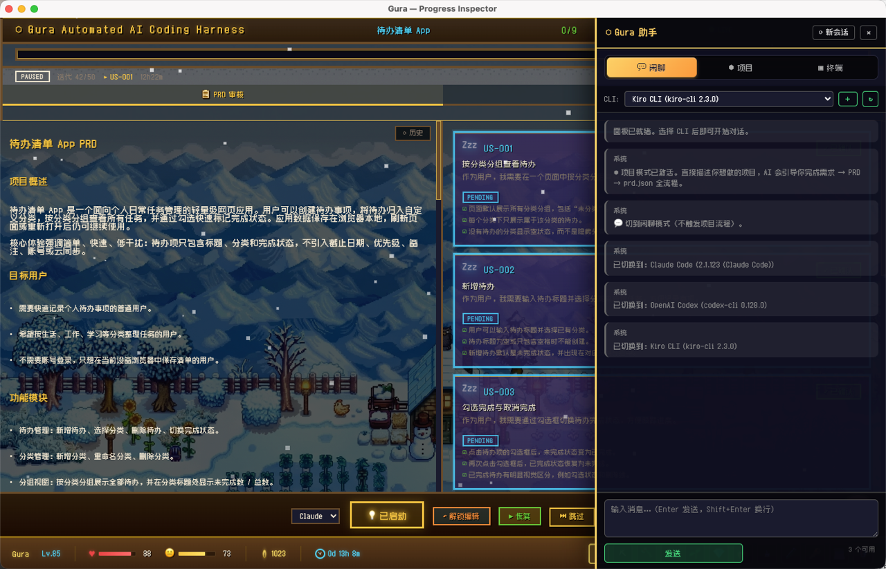
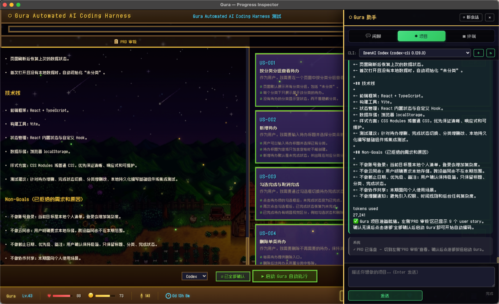
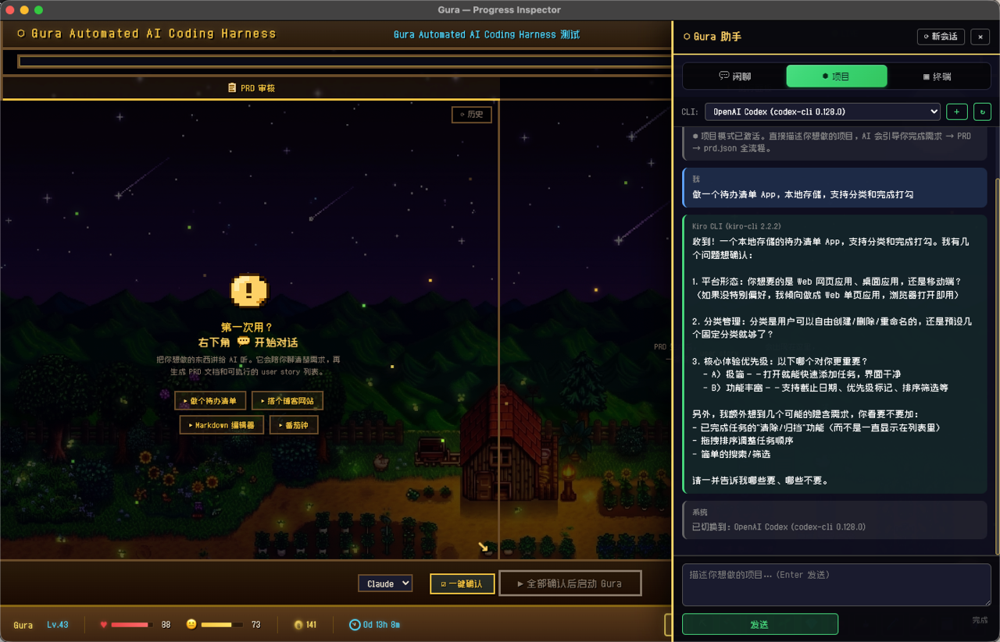

# GACoding — AI 自动化 Coding 系统

[English](#english) | 中文

一个让 AI 自动完成从需求到代码全流程的开发系统。用户只需描述需求，系统自动拆分 PRD、编写代码、验证测试，直到所有功能通过。


## 特性

- **需求到代码全自动** — 描述需求 → PRD → User Stories → 自动编码 → 验证 → 完成
- **Builder + Validator 循环** — AI 写代码后自动验证，失败则修复重试，直到通过
- **星露谷风格实时面板** — 四季背景、天气粒子、16 个动漫角色头像、实时状态动画
- **多 CLI 支持** — Claude Code / Codex / Kiro CLI / Gemini / Aider / Cursor Agent 等 20+ 种 AI CLI
- **桌面版** — Electron 桌面应用，集成项目选择、AI 对话面板、嵌入式终端
- **游戏化系统** — 经验值、等级、金币、HP、心情，让开发过程更有趣

### 截图

| PRD 审核 | 执行面板 |
|:---:|:---:|
|  |  |

| 对话引导 |
|:---:|
|  |

## 快速开始

### 前置条件

- Node.js 18+
- Python 3.9+
- 至少一个 AI CLI（推荐 [Claude Code](https://docs.anthropic.com/en/docs/claude-code)）

### 命令行版

```bash
# 克隆项目
git clone https://github.com/Gurabit77/GACoding.git
cd GACoding

# 准备你的项目（需要先有 prd.json）
cd your-project
mkdir -p scripts/gura
# 将你的 prd.json 放到 scripts/gura/prd.json

# 启动
./gura.sh /path/to/your-project
```

### 桌面版（Electron）

```bash
cd electron
npm install
npm start
```

首次启动会打开项目选择界面，选择项目目录后自动启动服务器并加载面板。

## 系统架构

```
用户描述需求
    ↓
Chat 面板（项目模式）：AI 引导需求澄清 → PRD → prd.json
    ↓
用户在面板审核确认 Story
    ↓
一键启动 Gura 执行引擎
    ↓
┌─────────────────────────────────┐
│  Builder Agent 写代码            │
│       ↓                         │
│  Validator Agent 验证            │
│       ↓                         │
│  未通过 → 修复 → 重新验证        │
│  通过 → 下一个 Story             │
│       ↓                         │
│  全部通过 → 最终整体验证         │
│       ↓                         │
│  完成                           │
└─────────────────────────────────┘
    ↓
面板实时展示全过程（SSE 推送）
```

## 项目结构

```
├── server.mjs              # HTTP 服务器 + SSE + 状态管理
├── gura.py                 # 执行引擎（Builder + Validator 循环）
├── ui.html                 # 星露谷风格面板（CSS + HTML + JS）
├── cli.mjs                 # 命令行工具
├── gura.sh                 # 一键启动脚本
├── BUILDER.md              # Builder Agent 指令
├── VALIDATOR.md            # Validator Agent 指令
├── FINAL_VALIDATOR.md      # 最终整体验证指令
├── AGENTS-template.md      # 项目规则模板
├── SKILL.md                # Skill 入口描述
├── Zpix.ttf                # 中文像素字体
├── avatars/                # 动漫角色头像
├── backgrounds/            # 四季背景图
├── commands/               # prime / plan-feature / create-rules
├── skills/
│   ├── prd/SKILL.md        # 需求 → PRD
│   ├── gura/SKILL.md       # PRD → prd.json
│   └── agent-browser/      # 浏览器自动化测试
└── electron/               # 桌面版
    ├── main.js             # Electron 主进程
    ├── preload.js          # contextBridge
    ├── cli-detector.js     # AI CLI 自动检测
    ├── cli-registry.js     # 自定义 CLI 注册
    ├── chat-runner.js      # 聊天 + PTY 终端
    └── renderer/           # 启动器 + 聊天面板
```

## 支持的 AI CLI

| CLI | 命令 | 状态 |
|-----|------|------|
| Claude Code | `claude` | 已知模板 |
| OpenAI Codex | `codex` | 已知模板 |
| Kiro CLI | `kiro-cli` | 已知模板 |
| Cursor Agent | `cursor-agent` | 已知模板 |
| Gemini CLI | `gemini` | 已知模板 |
| Aider | `aider` | 已知模板 |
| MiMo Code | `mimo` | 已知模板 |
| 其他 | 自动检测 | 通用发现 |

系统会自动扫描 PATH 中的所有可执行文件，通过 `--help` 输出中的 AI 关键词智能识别新 CLI。

## 面板功能

- **PRD 审核** — 左侧 PRD 文档，右侧 Story 卡片，逐个确认
- **执行面板** — 角色卡片实时状态、日志、进度条
- **设置** — 四季背景切换、天气粒子、昼夜、缩放
- **AI 对话** — 右侧聊天面板，支持闲聊 / 项目规划 / 终端三种模式
- **会话管理** — 自动归档历史会话，支持恢复

## API

| 路由 | 方法 | 功能 |
|------|------|------|
| `/api/status` | GET | 获取完整状态 |
| `/api/init` | POST | 初始化项目 |
| `/api/task` | PUT | 更新任务状态 |
| `/api/log` | POST | 写入日志 |
| `/api/gura/state` | GET/PUT | 读写执行状态 |
| `/api/gura/sync` | POST | 同步 prd.json → status |
| `/api/gura/launch` | POST | 启动执行引擎 |
| `/api/gura/pause` | POST | 暂停执行 |
| `/api/gura/resume` | POST | 恢复执行 |
| `/api/prd/review` | GET | 获取 PRD 数据 |
| `/api/prd/confirm` | POST | 确认 Story |
| `/api/session/list` | GET | 历史会话列表 |
| `/events` | SSE | 实时状态推送 |

## 作者

**Gurabit** — [GitHub](https://github.com/Gurabit77)

## 许可证

MIT

---

<a name="english"></a>

## English

**GACoding** is an AI-powered automated coding system. Describe what you want, and the system automatically creates a PRD, splits it into user stories, writes code, validates tests, and iterates until everything passes.

### Key Features

- **End-to-end automation** — From requirements to working code, fully automated
- **Builder + Validator loop** — AI writes code, validates, fixes failures, retries
- **Stardew Valley style dashboard** — Seasonal backgrounds, weather particles, pixel art characters
- **20+ AI CLI support** — Works with Claude Code, Codex, Kiro, Gemini, Aider, and more
- **Desktop app** — Electron app with project picker, chat panel, and embedded terminal
- **Gamification** — XP, levels, gold, HP, mood stats that react to development progress

### Quick Start

```bash
# Clone
git clone https://github.com/Gurabit77/GACoding.git
cd GACoding

# Desktop app
cd electron && npm install && npm start

# Or CLI mode
./gura.sh /path/to/your-project
```

### Author

**Gurabit** — [GitHub](https://github.com/Gurabit77)

### License

MIT
